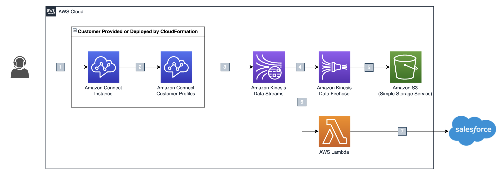

# Customer Profiles Export Demo

## Introduction
This project deploys a destination pipeline to allow the exported change and update events from Amazon Connect Customer Profiles to be delivered to Amazon S3 and also to a Salesforce instance.

## Architecture

1.	Agent create/update customer profile data via Amazon Connect Agent Workspace
2.	Amazon Connect instance sends create/update events into Amazon Connect Customer Profiles
3.	Customer Profiles create/update events are streamed through Amazon Kinesis Data Streams
4.	Amazon Kinesis Data Streams writes create/update events into Amazon Kinesis Data Firehose
5.	Amazon Kinesis Data Firehose exports Customer Profiles event data to Amazon S3
6.	AWS Lambda is triggered by the create/update events from Amazon Kinesis Data Stream
7.	AWS Lambda invokes Salesforce API to update Customer Profiles event data to Salesforce

## Prerequisites
- An AWS account
- An Amazon Connect instance.
- Amazon Connect Customer Profiles is enabled in the Amazon Connect instance. 
- A Salesforce instance with customer data.
- A Data source integration already created between Salesforce and Amazon connect using Amazon AppFlow with Salesforce contact as the specific object.

## Installation
1. Clone the repository
2. Run the `makeZip.sh` script to download dependencies: `./makeZip.sh`

3. Place the `./lambda.zip` and the `./template.yaml` files in to a deployment S3 bucket to deploy the CloudFormation stack from.
4. Deploy the stack 

## Usage
After the stack is deployed, you will need to manually set up the Customer Profiles Export function by selecting your Amazon Connect Instance and the Customer Profiles Domain within and enabling Export to the Kinesis Data Stream Created by this stack.

## Support
Tell people where they can go to for help. It can be any combination of an issue tracker, a chat room, an email address, etc.

## Contributing
State if you are open to contributions and what your requirements are for accepting them.

For people who want to make changes to your project, it's helpful to have some documentation on how to get started. Perhaps there is a script that they should run or some environment variables that they need to set. Make these steps explicit. These instructions could also be useful to your future self.

You can also document commands to lint the code or run tests. These steps help to ensure high code quality and reduce the likelihood that the changes inadvertently break something. Having instructions for running tests is especially helpful if it requires external setup, such as starting a Selenium server for testing in a browser.

## Security
See [CONTRIBUTING](CONTRIBUTING.md#security-issue-notifications) for more information.

## License
This project is licensed under the MIT-0 License. See the [LICENSE](LICENSE) file.
